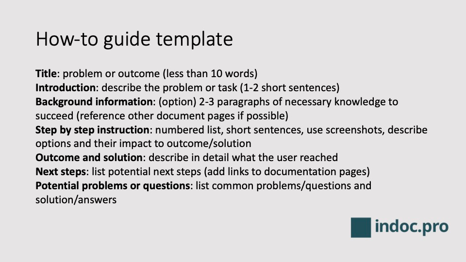

# Anleitung (How-To)

Der Dokumentationstyp "Anleitung" (Englisch: How-To) beschreibt konkret, wie ein Anwendungsfall oder Problem mit konkreten, einfachen Schritten gelöst werden kann.

Erfahren Sie mehr über das Erstellen von How-To / Anleitungsdokumenten unter https://indoc.pro/documentation-types/how-to-guide-software-products/ .

## Elemente einer Anleitung
- Titel: kurze, spezifische Beschreibung des Problems bzw. des Anwendungsfalls (max. 10 Worte)
- Einführung: Beschreiben Sie das Problem oder die Aufgabe mit 2-3 kurzen Sätzen
- Hintergrundinformationen: Wenn zusätzliche Informationen oder Kenntnisse erforderlich sind, sollten diese kurz zusammengefasst werden. Verwenden Sie Links zu weiterführenden Dokumenten, wie z. Produkteigenschaften, Glossar oder Erläuterungen.
- Schritt-für-Schritt-Anleitung: nummerierte Liste, mit kurzer Beschreibung, Bild/Screenshot und zusätzlichen Informationen. Wenn mehrere Optionen verfügbar sind, beschreiben Sie diese und die Auswirkungen auf das gewünschte Ergebnis.
- Ergebnis und Lösung: Beschreiben Sie detailliert, was der Benutzer erreicht hat
- Nächste Schritte: Wenn diese Aufgabe ein Teil eines größeren Prozesses ist, oder es andere Dokumente gibt, die der Benutzer möglicherweise benötigt – führen Sie diese hier auf, damit der Benutzer den Kontext versteht und weiter im Prozess arbeiten kann.
- Mögliche Probleme oder Fragen: Wenn es häufige Probleme oder Fragen gibt, die beim Ausführen der Anleitung auftreten können, beschreiben Sie diese.

## Vorlage für Anleitung
Verweis auf [Vorlage Anleitung](how-to-template.md) in externer Datei

## Anleitungsbeispiel
Der folgende Abschnitt enthält ein einfaches Beispiel. Es handelt sich um eine Anleitung zum Erstellen einer Anleitung.

### Anleitung zum Erstellen einer großartigen Anleitung
Mit den folgenden sieben Schritten lernen Sie, wie eine Anleitung erstellt werden kann.

### Hintergrundinformation
Fügen Sie einige Hintergrundinformationen hinzu - z.B. warum die Bereitstellung von Anleitungen für Ihre Kunden von großem Nutzen sein kann.
Dies kann ganz einfach sein, oder umfangreicher und sogar zusätzliche Informationen und Medien beinhalten.

### Schritte
Folgen Sie diesen Schritten, um ein neues Anleitungs-Dokument zu erstellen:

1. Sammeln Sie typische Probleme und Bedürfnisse Ihrer Kunden (z.B. beim Support-Team, beim Produktmanagement, sprechen Sie mit Ihren Kunden). Entscheiden Sie sich für das relevanteste.
2. Verstehen Sie das Problem und die passende Lösung.
3. Wenn keine Lösung bekannt ist, erarbeiten Sie diese mit Ihrem Team.
4. Erstellen Sie die erste Rohfassung der Anleitung (z.B. basierend auf dieser Vorlage)
5. Überarbeiten Sie das erstellte Dokument. Wenden Sie sich auch Kolleginnen und Kollegen aus anderen Abteilungen wie Produktmanagement, Entwicklung und Support.
6. Veröffentlichen Sie die Anleitung in Ihrer Produktdokumentation.
7. Messen Sie die Benutzerinteraktionen und verbessern Sie die Anleitung.

### Ergebnis
Das Ergebnis ist ein hilfreicher Anleitungs-Eintrag, der detaillierte Hilfe für ein bestimmtes Kundenproblem bietet. Ihre Benutzer sind glücklich. Ihr Support-Team hat weniger Arbeit. (in einer idealen Welt)

### Nächste Schritte
- Sie könnten weitere Anleitungen für andere Probleme hinzufügen. (zurück zu Schritt 1)
- Messen Sie die Interkation Ihrer Benutzer mit der Anleitung, ob einen Mehrwert für Ihren Kunden- und Nutzerstamm bietet.

### Mögliche Probleme und Fragen
- Wann sollte keine Anleitung erstellt werden?
  Ein How-to-Dokument ist vielleicht zu viel des Guten, wenn nur ein kurzer Text ausreicht - dann könnte ein FAQ-Eintrag ausreichen.
- Wie kann ich das Ergebnis meiner Anleitung messen?
  Ihre Support-Abteilung wird weniger Anfragen zu diesem Thema haben. Setzen Sie ein Dokumentationsprogramm ein, können damit spezifische Kennzahlen wie die Anzahl von Aufrufen ausgewertet werden.
