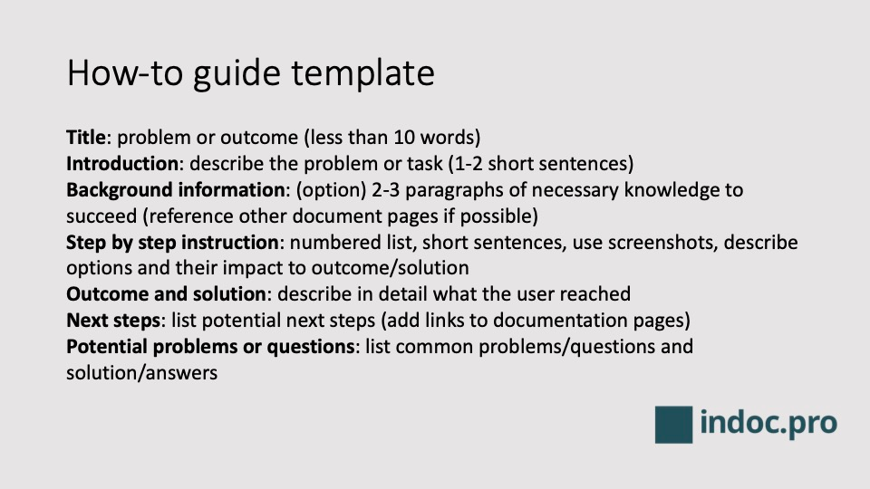

# How-to guide

How to guides are a helpful tool to create good user documentation for your readers and users. They describe how to solve a need or problem with simple steps.

Find out more about creating well-crafted how-to guides at https://indoc.pro/documentation-types/how-to-guide-software-products/ .

## Elements of a how-to entry
- Title: should be precise and describe the problem / solution
- Introduction: describe the problem or task with 1-2 short sentences
- Background information: if additional information or knowledge is necessary to successfully progress in the how to guide, add them at the beginning. Keep it short and add links to additional documentation as e.g. product features, glossary or explanations.
- Step-by-step guide: numbered list, with short description, image/screenshot and additional information whenever possible; if multiple options are available describe them and the impact to the desired outcome
- Outcome and solution: describe in detail what the user reached
- Next steps: if there are next steps in a process, or other related documentation that the user might need – list them here, so the user can proceed and is not lost in the journey.
- Potential problems or questions: if there are common problems or questions that the user might encounter during the how-to guide, add them at the end (and maybe reference at the specific step); this educates the user and lowers your support interactions

## How-to template
Reference to [How-to template](how-to-template.md) in external file

## How-to example
The following section provides a simple example for a how-to entry to create a how-to entry.

### How-to write a great how-to entry
Learn how to create a how-to entry.

### Background information
Add some background information - e.g. why providing how-to guides might be highly beneficial for your customer base.
This can be quite simple, or even include additional information and resources.

### Steps
You can follow these steps to create a new how-to entry:

1. Explore customer need or pain points for potential how-to ideas
2. Understand the problem and the solution
3. If no solution exists, create and define one
4. Create the how-to entry
5. Validate and review the generated entry, also check with product management, development and support department
6. Publish the how-to entry to your product documentation
7. Measure and improve

### Outcome
The result is a well research and written how-to entry that provides detailed help for a specific customer problem.

### Next steps
- You could add more how-to entries for other problems.
- Measure the result of the documentation, if it provides an additional value to your customer and user base.

### Potential problems and questions
- When is a how-to document not appropriate?
  _A how-to document might be overkill if only a short text is enough - than a FAQ entry could be sufficient._